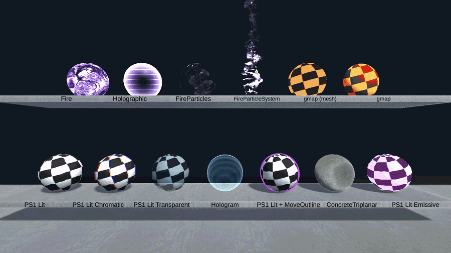

# Shader Gallery

I write shaders and then lose them. One sits in a game project, another in some test
scene, a third one I only have as a screenshot. So I made a shelf to put them on.

One Unity scene: shelves, a sphere per shader, a label under each. Drop a shader into the
project, tick it in a list, and it's on a shelf with the rest.

Unity 6000.0.32f1, URP 17.0.3. Open `Assets/Scenes/ShaderGallery.unity` and select
**Gallery Rig**, the panel is in the inspector.

## Adding a shader

Put the file in `Assets/Shaders/Local/`, then **Shader Gallery → Shader List**, Rescan,
tick it, Apply. The material, the sphere, the label and the close-up button appear on
their own, and the shelves rearrange to fit.

Ten per shelf, split evenly, so eleven shaders sit as 6+5 and twenty as 10+10. You can
set the number yourself in the panel.

## Where the shaders come from

`Assets/Shaders/Shared/` is a copy of my [unity-shaders](https://github.com/xehster/unity-shaders)
repo, brought in by a scheduled GitHub Action. Don't edit it, the next sync overwrites the
whole folder. To change one of those shaders, copy it to `Local/` without its `.meta` and
rename the shader on the first line. The copy is then yours and nothing overwrites it.

`Local/` is never touched by anything, so pulling updates can't eat your work.

## 2D shaders

UI shaders don't work on a sphere, so they get a flat panel. A camera off to the side
renders a reference sphere into a texture, and that's the picture the shader recolours,
live. Swap it for your own art in **Sample Texture** on the rig.

The list guesses 2D from the stencil and colour mask properties that UI-Default shaders
carry. The **3D / 2D** button next to the tick overrules the guess.

## Recording

**Recording → Record the gallery** writes `docs/gallery.gif`. Pick a close-up first and
the second button records just that shader.

It renders frame by frame rather than grabbing the screen, so the spacing is even and the
loop closes: recording length comes from the motion mode, one bounce cycle or one full
spin. Needs ffmpeg on PATH, or installed with `winget install Gyan.FFmpeg`.

## The panel

**Spin / Bounce / Still** is how the row moves. Everything animates in Edit Mode, no need
to enter play, and particle systems are stepped by hand for the same reason.

**Close-up** flies the camera to one subject and hides the others. **Labels** turns the
text off for a clean recording.

**Shader settings** holds a foldout per material, drawn by Unity's own material inspector,
so a new shader brings its settings with it.

**Renderer features** toggles the full-screen passes on the URP renderer. Those are
project-wide, put them back when you're done.

## Notes

Some textures are web placeholders, there so things render on import: the concrete maps in
`Assets/Textures/Concrete/` and the two `placeholder_*` files by the particle system. Not
mine to license, swap them before shipping anything.
